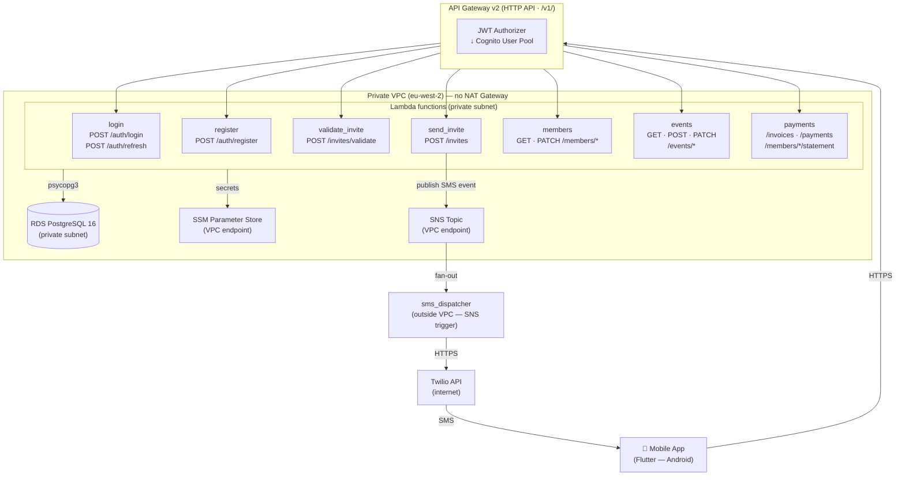
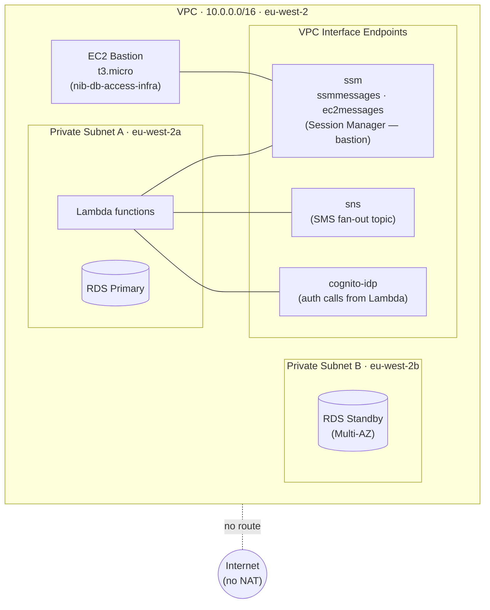
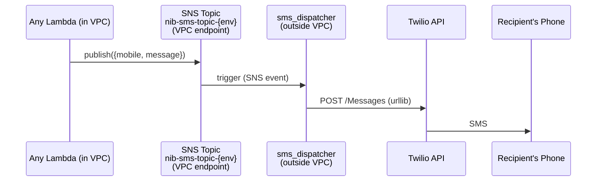
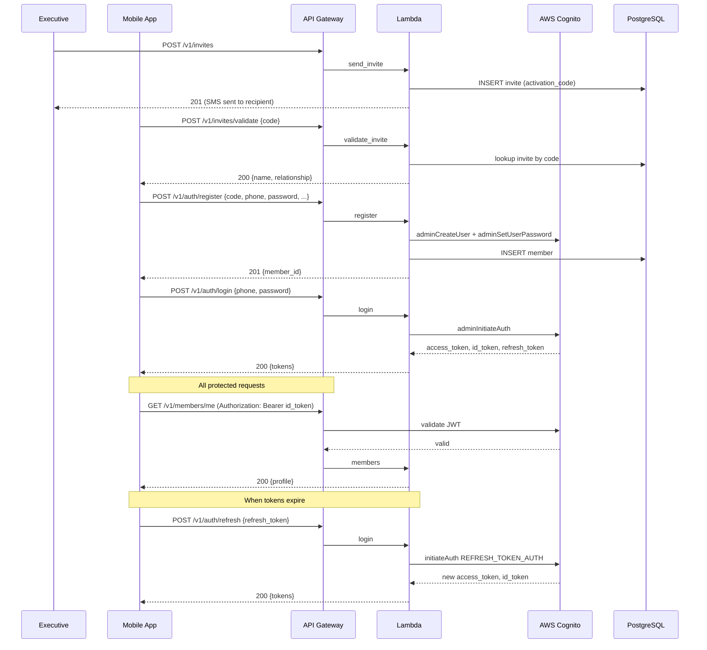

# NIB Backend

**NIB = Ndi Igbo Basingstoke** — a members-only app to digitise the activities of a Nigerian community association in Basingstoke, UK. Invite-only registration, not open to the public.

---

## Table of Contents

- [Tech Stack](#tech-stack)
- [Architecture Overview](#architecture-overview)
- [Infrastructure](#infrastructure)
- [API Lambdas](#api-lambdas)
- [SMS Fan-out](#sms-fan-out)
- [Internal Code Architecture](#internal-code-architecture)
- [Database Schema](#database-schema)
- [Authentication & Authorisation](#authentication--authorisation)
- [API Endpoints](#api-endpoints)
- [CI/CD Pipeline](#cicd-pipeline)
- [DB Access & Migrations](#db-access--migrations)
- [Design Decisions](#design-decisions)
- [Local Development](#local-development)
- [Seeding the Admin User](#seeding-the-admin-user)

---

## Tech Stack

| Layer | Technology |
|---|---|
| Mobile | Flutter (Android first, iOS later) |
| Auth | AWS Cognito (phone number as username) |
| API | AWS API Gateway v2 (HTTP) + Lambda (Python 3.13) |
| Database | RDS PostgreSQL 16 (psycopg3) |
| SMS | Twilio via SNS fan-out |
| Secrets | AWS SSM Parameter Store |
| Tracing | AWS X-Ray via Lambda Powertools |
| IaC | Terraform (eu-west-2 / London) |
| CI/CD | GitHub Actions (OIDC — no stored AWS credentials) |

---

## Architecture Overview



**Key constraint:** No NAT Gateway (cost decision). All VPC Lambdas can only reach AWS services via VPC Interface Endpoints. The `sms_dispatcher` Lambda is the only one outside the VPC, specifically so it can reach the Twilio API.

---

## Infrastructure

### VPC Layout



### Terraform Structure

```
infra/
├── environments/
│   ├── dev/          — dev environment (auto-deployed on push to main)
│   └── prod/         — prod environment (manual trigger only)
└── modules/
    ├── vpc/          — VPC, subnets, security groups, VPC endpoints
    ├── db/           — RDS PostgreSQL instance
    ├── lambda/       — Lambda function + IAM + API Gateway integration
    └── cognito/      — User pool + app client
```

### Cost (~£22/month when fully deployed)

| Component | Cost |
|---|---|
| RDS db.t4g.micro + 20GB gp2 | ~£10 |
| SNS VPC interface endpoint | ~£6 |
| SSM VPC endpoints | ~£6 |
| Lambda, API GW, Cognito, S3 | ~£0 |

---

## API Lambdas

| Lambda | Routes | Auth Required |
|---|---|---|
| `login` | `POST /v1/auth/login`, `POST /v1/auth/refresh` | No |
| `register` | `POST /v1/auth/register` | No |
| `validate_invite` | `POST /v1/invites/validate` | No |
| `send_invite` | `POST /v1/invites` | Yes |
| `members` | `GET /v1/members`, `GET /v1/members/{id}`, `GET /v1/members/me`, `PATCH /v1/members/{id}`, `GET /v1/members/me/pledges` | Yes |
| `events` | All `/v1/events/*` routes | Yes |
| `payments` | `POST /v1/invoices/{id}/payments`, `DELETE /v1/payments/{id}`, `GET /v1/members/{id}/statement` | Yes |
| `sms_dispatcher` | SNS trigger (not HTTP) | N/A |

---

## SMS Fan-out

SMS cannot be sent directly from VPC Lambdas (no NAT, no Twilio VPC endpoint). The solution is a fan-out pattern:



This pattern is also reusable for any future SMS (reminders, notifications) — any Lambda can publish to the SNS topic and `sms_dispatcher` will handle delivery.

**Twilio credentials** are stored as SecureString in SSM (`/nib/twilio/account_sid`, `/nib/twilio/auth_token`, `/nib/twilio/from_number`) and loaded at cold start only.

---

## Internal Code Architecture

### Layer Structure

```
src/
├── functions/
│   ├── login/            — Lambda handler only
│   ├── register/
│   ├── send_invite/
│   ├── validate_invite/
│   ├── members/
│   ├── events/
│   ├── payments/
│   └── sms_dispatcher/
└── shared/               — Lambda Layer (shared across all functions)
    ├── db.py             — DB connection management
    ├── models/           — Pydantic input validation models
    ├── repositories/     — SQL queries, one class per table/domain
    ├── serializers/      — Output serialization (plain Python dicts)
    ├── services/         — Business logic
    ├── uow/              — Unit of Work pattern
    ├── reference_data/   — Enums for status codes
    └── instrumentation/  — X-Ray tracer wrapper
```

### Unit of Work Pattern

Each Lambda uses a context-manager-based Unit of Work (UoW) that:
- Provides a single shared DB connection per request
- Commits on success, rolls back on exception
- Reconnects automatically if the cached connection is stale

```python
with MemberUoW() as uow:
    caller = uow.members.get_by_cognito_sub(cognito_sub)
    result = some_service(uow, caller, ...)
    # auto-commit on exit
```

Each UoW exposes only the repositories relevant to its domain:

| UoW | Repositories |
|---|---|
| `InviteUoW` | members, invites |
| `RegisterUoW` | members, memberships, periods, invoices, invites |
| `MemberUoW` | members, pledges |
| `EventUoW` | members, events, pledges |
| `PaymentUoW` | members, periods, invoices, payments |

### DB Connection Caching

Connections are cached at module level and reused across Lambda invocations within the same container. The connection is replaced reactively if `commit()` fails, avoiding the ~3s reconnect overhead on every warm invocation.

### Serializers

Output serialization is handled by plain Python functions in `shared/serializers/`, completely decoupled from DB row shapes. This means DB column renames do not automatically leak into API responses.

---

## Database Schema

```
memberships
├── id (PK)
├── membership_type       — individual | family
├── primary_member_id     — FK → members.id
└── timestamps

members
├── id (PK)
├── cognito_user_id       — Cognito sub (used to look up member on each request)
├── mobile, email
├── first_name, last_name
├── address, town, post_code
├── state_of_origin, lga
├── birthday_day, birthday_month
├── relationship_status
├── emergency_contact_name, emergency_contact_phone
├── member_role           — member | executive | admin
├── status                — active | inactive | pending | rejected
├── is_legacy             — true for pre-existing members added manually
├── date_joined
├── membership_id         — FK → memberships.id
└── timestamps

invites
├── id (PK)
├── first_name, last_name, mobile
├── activation_code       — 8-char hex, expires after 30 days
├── invited_by            — FK → members.id
├── relationship          — spouse | other
├── status                — pending | sent | used | expired | cancelled
├── is_legacy
├── expires_at
└── timestamps

membership_periods
├── id (PK)
├── membership_id         — FK → memberships.id
├── start_date, end_date
├── status                — active | expired
└── timestamps

invoices
├── id (PK)
├── membership_period_id  — FK → membership_periods.id
├── invoice_number        — NIB-0001, NIB-0002, ... (sequence)
├── issue_date, due_date
├── amount_due            — pulled from membership_fees at creation time
├── status                — unpaid | partial | paid
└── created_at

payments
├── id (PK)
├── invoice_id            — FK → invoices.id
├── amount
├── method                — bank_transfer | cash | cheque | other
├── reference
├── received_by           — FK → members.id (exec who recorded it)
├── received_at
└── timestamps

events
├── id (PK)
├── title, date, description
├── type                  — pledge | contribution | general
├── status                — upcoming | completed
├── created_by            — FK → members.id
└── timestamps

event_items  (pledge events only)
├── id (PK)
├── event_id              — FK → events.id
├── name, unit, quantity_needed
└── created_at

pledges  (pledge events only)
├── id (PK)
├── event_id              — FK → events.id
├── member_id             — FK → members.id
├── event_item_id         — FK → event_items.id
├── quantity
├── status                — pledged | cancelled
└── timestamps
UNIQUE (member_id, event_item_id)

event_contributions
├── id (PK)
├── event_id              — FK → events.id
├── member_id             — FK → members.id (nullable = anonymous)
├── pledge_id             — FK → pledges.id (nullable = unlinked cash)
├── amount
├── recorded_by           — FK → members.id
├── received_at
└── timestamps

membership_fees
├── id (PK)
├── membership_type
├── annual_fee
├── due_days
└── effective_from        — current fee = latest row where effective_from <= today

reference_data            — lookup table for all enum-style values
organisation              — single-row bank details table

```

### Billing Model

- Annual invoice is raised per **membership group** (not per individual member)
- Spouse and primary member share the same `membership_id` and therefore the same invoice
- Members can make multiple partial payments toward the annual invoice
- Invoice status progresses: `unpaid` → `partial` → `paid`
- Fee amounts are not hardcoded — read from `membership_fees` at invoice creation time to support future fee changes

---

## Authentication & Authorisation

### Cognito Setup

- User pool in eu-west-2
- Phone number as alias (sign-in identifier)
- UUID as the actual Cognito username (generated at registration)
- `ADMIN_USER_PASSWORD_AUTH` flow — server-side auth from Lambda, no SRP
- JWT authorizer on API Gateway — all protected routes validate the `id_token`

### Auth Flow



### Roles

| Role | Permissions |
|---|---|
| `member` | View own profile, send invites, view events, create/manage own pledges, view own statement |
| `executive` | Everything above + create/edit events, add/edit/delete items, record contributions and payments, view all member profiles |
| `admin` | Same as executive (reserved for system admin) |

Role is stored on the `members` table and checked in each service function — not encoded in the JWT.

---

## API Endpoints

Full documentation in [openapi.yaml](openapi.yaml). Summary:

### Auth (no JWT required)
| Method | Path | Description |
|---|---|---|
| POST | `/v1/auth/login` | Authenticate, returns JWT tokens |
| POST | `/v1/auth/refresh` | Exchange refresh token for new tokens |
| POST | `/v1/invites/validate` | Validate activation code |
| POST | `/v1/auth/register` | Register using activation code |

### Invites
| Method | Path | Description |
|---|---|---|
| POST | `/v1/invites` | Send invite SMS (exec or member) |

### Members
| Method | Path | Description |
|---|---|---|
| GET | `/v1/members` | List all active members |
| GET | `/v1/members/me` | Get own full profile |
| GET | `/v1/members/{id}` | Get any member's full profile |
| PATCH | `/v1/members/{id}` | Update profile fields |
| GET | `/v1/members/me/pledges` | Get own active pledges |
| GET | `/v1/members/{id}/statement` | Get membership statement |

### Events
| Method | Path | Description |
|---|---|---|
| POST | `/v1/events` | Create event (exec only) |
| GET | `/v1/events` | List all events |
| GET | `/v1/events/{id}` | Get event detail with items/pledges/contributions |
| PATCH | `/v1/events/{id}` | Update event (exec only) |
| POST | `/v1/events/{id}/items` | Add items to pledge event (exec only) |
| PATCH | `/v1/events/{id}/items/{itemId}` | Edit item (exec only, no active pledges) |
| DELETE | `/v1/events/{id}/items/{itemId}` | Delete item (exec only, no active pledges) |
| POST | `/v1/events/{id}/pledges` | Create pledge |
| PATCH | `/v1/events/{id}/pledges/{pledgeId}` | Update pledge quantity |
| DELETE | `/v1/events/{id}/pledges/{pledgeId}` | Cancel pledge |
| POST | `/v1/events/{id}/contributions` | Record contribution (exec only) |

### Payments
| Method | Path | Description |
|---|---|---|
| POST | `/v1/invoices/{id}/payments` | Record payment (exec only) |
| DELETE | `/v1/payments/{id}` | Delete payment (exec only) |

---

## CI/CD Pipeline

### deploy-dev.yml (triggers on push to `main`)

```
1. Run pytest
2. Package each Lambda function → upload to S3
3. Package shared layer → upload to S3
4. Package migrations zip → upload to S3 (not auto-applied)
5. terraform apply (dev environment)
```

### deploy-prod.yml (manual trigger only)

Same steps as dev but targets the prod Terraform state. Prod is only deployed intentionally — never on push.

### OIDC Authentication

GitHub Actions assumes `TerraformUserRole` via OIDC — no long-lived AWS credentials stored in GitHub secrets. Twilio credentials are stored as GitHub secrets and passed as Terraform variables at apply time.

---

## DB Access & Migrations

A separate project (`nib-db-access-infra`) provisions:
- EC2 `t3.micro` bastion in the private subnet
- SSM VPC endpoints — connect via Session Manager, no SSH required
- Scripts baked into the AMI: `connect-db`, migration runner

### Running Migrations

```bash
# Start bastion via AWS Console or CLI, then connect via SSM Session Manager
# On the bastion:
/usr/local/bin/connect-db                  # opens psql
# Run migration scripts via the migration runner script
```

Migrations are versioned with Flyway naming convention (`V1__`, `V2__`, ...).

### Migration History

| Version | Description |
|---|---|
| V1 | Initial schema — members, memberships, invites, membership_periods, reference_data |
| V2 | Registration schema — invoices, payments, membership_fees, organisation, profile fields |
| V3 | Events schema — events, event_items, pledges, event_contributions |
| V4 | Add date_joined and is_legacy to invites |
| V5 | Add due_days to membership_fees |
| V6 | Add general event type to reference_data |

---

## Design Decisions

### No NAT Gateway
Cost decision (~£30/month saving). All outbound internet access from Lambda is blocked. VPC Interface Endpoints are used for AWS services. The Twilio SMS fan-out pattern (SNS topic → out-of-VPC Lambda) was introduced specifically to work around this constraint.

### SMS: Twilio via Fan-out (not SNS SMS direct)
SNS SMS direct requires UK alphanumeric Sender ID registration (expensive) and a support ticket to raise the spending limit. Twilio gives better deliverability and DX. The fan-out pattern adds one Lambda and ~£3/month.

### Path Versioning (/v1/)
`/v1/` is a path prefix, not an API Gateway stage. This keeps the URL clean, allows `/v2/` routes to coexist on the same gateway in future, and avoids the stage-name-in-URL pattern.

### Phone Number as Username
Members are identified by mobile number. Cognito uses phone_number as an alias attribute. The actual Cognito username is a UUID (generated at registration) to keep admin operations stable if a phone number changes.

### UoW + Repository Pattern
Business logic lives in service functions that operate against abstract UoW interfaces. Repositories contain all SQL. This keeps Lambdas thin (routing only) and makes the codebase testable without a real database.

### Serializers as a Separate Layer
API responses are built by dedicated serializer functions, not by returning raw DB rows. This decouples the API contract from the DB schema — a column rename in the DB doesn't automatically break the API.

### Pydantic for Input Only
Pydantic models are used only for validating incoming request bodies. Output serialization uses plain Python dicts for simplicity and to avoid coupling response shape to a model definition.

### Connection Caching
psycopg3 connections are cached at Lambda module level and reused across warm invocations. The UoW reconnects automatically if `commit()` fails. This eliminates a ~3-4s reconnect overhead per request that was visible during testing.

### Billing at Membership Group Level
One invoice per membership group per year. Spouse and primary member share the same invoice. This reflects how the association actually bills — a family pays one annual fee, not two.

---

## Local Development

### Prerequisites
- Python 3.13
- AWS CLI configured with credentials that can assume `TerraformUserRole`

### Setup

```bash
python -m venv .venv
source .venv/Scripts/activate      # Windows
pip install -r requirements.txt
```

### Running Tests

```bash
pytest
```

Tests use mocked AWS services and a mocked DB connection — no real AWS infrastructure required.

### Assuming the Terraform Role

```bash
source ./scripts/assume_role.sh
```

---

## Seeding the Admin User

Run once after initial `terraform apply` and migrations:

```bash
# Step 1 — locally (creates Cognito user, prints cognito_sub)
./scripts/bootstrap_admin_cognito.sh

# Step 2 — on the EC2 bastion via SSM Session Manager
bash /path/to/scripts/bootstrap_admin_db.sh "<cognito_sub>" "<phone>"
# Follow the printed SQL instructions, paste into connect-db
```
